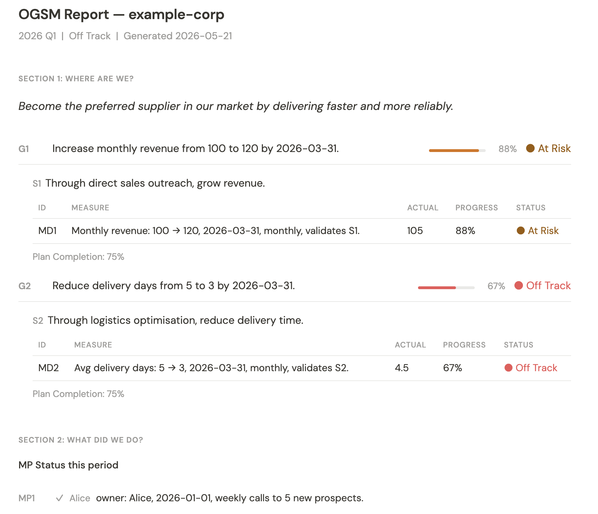

# OGSM Plugin

> **Language / 語言:** [English](#english) · [繁體中文](#繁體中文)

---

<a name="english"></a>
## English

### What Is OGSM?

OGSM connects ambition to daily execution through four layers:

| Layer | Meaning | Key question |
|-------|---------|-------------|
| **O** Objective | Who you serve, what value you create, vivid picture of success | Are we aiming at the right target? |
| **G** Goals | Measurable outcomes — verb + noun + baseline + target + date range | How do we know we've arrived? |
| **S** Strategies | Selected resources, methods, and tools that reach the Goals | What will we actually invest in? |
| **MD** Measure Dashboard | Indicators that validate each Strategy is working | Is the investment producing results? |
| **MP** Measure Plans | Time-ordered action plans that drive MD movement | What are we doing this week? |

The core logic runs backward: **MP → MD → S → G → O**. Every action should trace to a Goal through a Strategy. Strong OGSMs make it easier to say no.

---

[](LICENSE)

---

### Quick Start

1. Install the plugin (see [Installation](#installation)) and restart Claude Code
2. Say **"help me get started with OGSM"** — the plugin detects your state and routes you correctly (no skill names to remember)
3. Answer the questions to build your profile — one question at a time
4. Say **"what should I focus on this week based on our OGSM?"** — get this week's execution priorities
5. Every Friday say **"let's do the weekly OGSM review"** — close the execution loop

---

### What Can This Plugin Do?

**Strategy that never gets executed?**
A lot of strategy documents just sit there. This plugin turns your OGSM into what to do this week, what to say no to, and which metrics to watch — so strategy becomes weekly action instead of a document on the wall.

**Calendar full, but unclear what actually matters?**
Tell the plugin your schedule and it checks which time slots are advancing a Strategy and which are just consuming time — then gives you concrete suggestions for what to change.

**Metrics only reviewed at month-end?**
The plugin generates an HTML execution report from your weekly review data automatically. Progress and health status (🟢 On Track / 🟡 At Risk / 🔴 Off Track) for every indicator — no manual work, no server required.

---

### Plugin Loop

This plugin makes OGSM operational through a repeatable loop:

```
ogsm-import (existing OGSM)
    ↓
ogsm-define
    ↓
ogsm-translate ── ogsm-plan-annual (optional, year-start)
    ↓
ogsm-audit-plan  ──  ogsm-calendar-brief (optional)
ogsm-audit-schedule ──────────────────────────────┘
    ↓
ogsm-realign
    ↓
ogsm-weekly-review ── ogsm-plan-annual update (month-end)
```

Persistent OGSM data is stored under `.ogsm/` in your project. Nothing is written without your explicit confirmation.

### What Do I Want To Do?

---

#### Set up or import an OGSM

Don't know where to start? Say:
```
help me get started with OGSM
```
The plugin detects whether you have a profile and routes you to the right skill.

Already have an OGSM document? Say:
```
import my OGSM, the file is at ~/Downloads/strategy-2026.md
```
The plugin auto-maps non-standard headings (KPI → MD, OKR → Goals), confirms the mapping, then saves the profile.

Supports a two-tier structure: a **company profile** sets the top-level O/G/S/MD/MP; **department profiles** reference it. Department Goals can align to a company Goal or Strategy, or be declared as enabling goals that support other departments.

---

#### Turn your OGSM into this week's actions

At the start of each week say:
```
what should I focus on this week based on our OGSM?
```
Output: priority themes, time allocation guidance, MD check-in schedule, say-no list.

---

#### Review a plan or schedule

Audit a quarterly plan:
```
review this Q3 roadmap against our OGSM
```
The plugin maps each item to a Strategy, MD, and MP — scoring alignment and surfacing gaps.

Audit your week's schedule:
```
does my schedule this week support our OGSM?
```
Three-step flow: `ogsm-calendar-brief` (normalise calendar) → `ogsm-audit-schedule` (check time allocation) → `ogsm-realign` (output revised schedule).

---

#### Track execution progress

**Weekly review (every Friday):**
```
let's do the weekly OGSM review
```
Compares actual work against MD and MP, surfaces patterns, proposes context updates.

**HTML execution report (run any time):**

Generated from `.ogsm/` data — no server required:

```bash
node -e "
const { loadSources } = require('./scripts/ogsm-status/loader');
const { buildViewModel } = require('./scripts/ogsm-status/view-model');
const { render } = require('./scripts/ogsm-status/renderer');
const fs = require('fs');
const sources = loadSources('.ogsm', 'company', 'your-slug');
fs.writeFileSync('ogsm-report.html', render(buildViewModel(sources)));
"
open ogsm-report.html
```

Replace `your-slug` with the `slug` value in your company profile frontmatter.

Report sections:
- **Section 1** — Goal progress %, Strategy rows, MD progress bars, expandable MP plan cards
- **Section 2** — Health counts across all MDs (🟢 / 🟡 / 🔴 / ⚪)
- **Section 3** — Alignment diagnostics (missing MD for a Strategy, broken department refs, etc.)

**To get real numbers in the report:**
1. Complete `ogsm-define` so a profile exists
2. Run `ogsm-weekly-review` each week (this produces the actuals data)
3. Run the report command above

Until weekly reviews exist, all MDs show ⚪ No Data — this is correct behaviour.

**Annual plan table (create at year-start, update monthly):**
```
generate the annual plan table
```
Expands your OGSM into a 12-column monthly tracking table. At month-end say:
```
update this month's MD actuals
```
The plugin extracts figures from your weekly reviews, asks you to confirm, and fills in the actuals.

---

#### Company vs Department profiles

The plugin supports a two-tier profile structure. A **company profile** sets the top-level Objective, Goals, and Strategies for the whole organization. **Department profiles** inherit from it — each one must reference a parent company profile.

```
profiles/
  company/xxx-company.md         ← top-level O, G, S, MD, MP
  departments/sales.md           ← must reference company/xxx-company
  departments/operations.md      ← must reference company/xxx-company
```

`ogsm-define` enforces this: it will ask for scope (company or department) before saving, and block saving a department profile without a confirmed parent.

**Goal alignment annotations** — each department Goal must declare one of two types via an inline HTML comment:

| Type | Meaning | Example |
|------|---------|---------|
| `aligned` | Traces to a specific company layer (G or S) | `<!-- goal_type: aligned \| parent_ref: company-G1 -->` |
| `enabling` | Supports other departments' ability to execute | `<!-- goal_type: enabling \| supports: [sales, ops] -->` |

A company Strategy can become a department Goal (`parent_ref: company-S2`). This is valid — the relationship is energy transformation, not one-way cascade.

MP entries can optionally declare cross-department dependencies: `<!-- depends_on: sales/MP2 -->`.

`validate-alignment.js` checks these annotations before saving. Invalid `parent_ref` values (pointing to non-existent company layers) block the save; missing annotations produce warnings only.

#### Profile format

A saved profile is a Markdown file with these required sections:

```markdown
---
scope: company
slug: xxx-company
parent: null
last_confirmed: 2026-05-09
---

## Objective
## Goals
## Strategies
## MD
## MP
## Review Cadence
```

See `examples/sample-ogsm-profile.md` for a complete example.

---

### Skills

> Not sure which skill to use? Say "help me get started with OGSM" and the plugin decides for you.

#### `ogsm-start` — Find your starting point

Entry point for the plugin. Detects whether you already have a profile and routes you to the right skill — no need to know skill names. New users are guided to create or import a profile; returning users see a menu to audit, review, or realign.

**Trigger:** "Where do I start?" / "How do I use OGSM?" / any message with no clear OGSM task

---

#### `ogsm-import` — Import an existing OGSM

Accepts an existing OGSM from a file path or pasted text. Auto-maps non-standard headings (e.g. "KPI" → MD, "OKR" → Goals) and confirms the mapping with you. Then hands off to `ogsm-define` to validate OGSM principles, fill any gaps, and save the profile.

**Trigger:** "Import my existing OGSM" / "I already have an OGSM, help me bring it in"

---

#### `ogsm-define` — Create or repair an OGSM profile

Build the baseline profile from scratch or fix an existing one. The skill asks one question at a time until all required fields are complete. Department profiles must reference a parent company profile. When defining a department profile, the skill walks through each Goal and asks whether it is `aligned` (traces to a specific company layer) or `enabling` (supports other departments), then adds the appropriate annotation. `validate-alignment.js` is run before saving — errors block the save, warnings do not.

**Trigger:** "Help me create an OGSM" / "Review and fix my OGSM"

---

#### `ogsm-translate` — Turn OGSM into operational guidance

Converts the confirmed profile into weekly or monthly priorities, time allocation guidance, MD check-in schedule, and decision rules for saying no.

**Trigger:** "What should I focus on this week based on my OGSM?"

---

#### `ogsm-calendar-brief` — Prepare a Google Calendar summary

Reads Google Calendar events (if the connector is available) or accepts a pasted agenda dump and produces the normalized schedule table used by `ogsm-audit-schedule`. This is the only skill that may access Google Calendar.

**Trigger:** "Prepare a calendar brief for this week before auditing my schedule"

---

#### `ogsm-audit-plan` — Review a plan against OGSM

Maps each item in a plan, OKR, roadmap, or initiative list to a Strategy, MD, and MP. Scores alignment and identifies gaps. For department profiles, also checks that each `aligned` Goal's `parent_ref` still matches an existing layer in the current company profile, flags missing `goal_type` annotations, and surfaces any `depends_on` dependency chains.

**Trigger:** "Audit this quarterly plan against our OGSM"

---

#### `ogsm-audit-schedule` — Review a weekly schedule against OGSM

Normalizes agenda input into a structured table, then checks whether time allocation supports Strategies and includes MD check-ins and MP execution blocks.

**Trigger:** "Does my schedule this week support our OGSM?"

---

#### `ogsm-realign` — Produce a revised plan or schedule

Takes audit findings and rewrites the plan or schedule with concrete changes. Each change is explained with its MP → MD → S → G → O linkage.

**Trigger:** "Rewrite the schedule based on the audit findings"

---

#### `ogsm-weekly-review` — Close the loop and update context

Compares actual work against Strategies, MD, and MP. Identifies recurring patterns, proposes operating context updates, and surfaces any OGSM profile changes needed. Also writes a `<!-- md-actual: MD1=..., MD2=... -->` marker into the MD movement summary so monthly actuals can be extracted later by `ogsm-plan-annual`.

**Trigger:** "Let's do the weekly OGSM review"

---

#### `ogsm-plan-annual` — Generate and track the annual MD/MP plan

Expands a confirmed OGSM into a full-year tracking table at `.ogsm/plans/<scope>/<slug>/<year>-annual.md`. Each Strategy gets two rows (plan + actual) with 12 month columns containing MD milestones and MP execution slots.

- **Generate mode** (year-start): proposes linear monthly MD milestones from baseline → target, lets you adjust each value, assigns MP items to specific months, and writes the table after confirmation.
- **Update mode** (month-end): runs `extract-md-actuals.js` against this month's weekly reviews to read the structured `md-actual` markers, asks you to confirm extracted values, and fills in the actual cells.

**Trigger:** "Generate annual plan table" / "Update this month's MD actuals" / "ogsm-plan-annual"

---

### OGSM Status Report

The plugin ships a standalone HTML execution report generated from `.ogsm/` data — no server required. It is built from six Node.js modules in `scripts/ogsm-status/`:



| Module | Role |
|--------|------|
| `parse-profile.js` | Parses an OGSM profile markdown file into a structured object |
| `loader.js` | Loads profile, weekly-review actuals, and MP status from `.ogsm/` |
| `compute.js` | Computes MD progress percentages and health scores (on\_track / at\_risk / off\_track / no\_data) |
| `diagnose.js` | Alignment diagnostics engine — detects structural gaps and annotation issues |
| `view-model.js` | Assembles all data into a render-ready view model |
| `renderer.js` | Renders a self-contained HTML file from the view model |

#### Report sections

| Section | Content |
|---------|---------|
| **1 — Execution view** | Goals with progress %, Strategies, MD progress bars, expandable MP plan cards |
| **2 — Health summary** | Counts of on\_track / at\_risk / off\_track / no\_data across all MDs |
| **3 — Alignment diagnostics** | Errors and warnings from the diagnostics engine (see below) |

#### Alignment diagnostics (`diagnose.js`)

The diagnostics engine runs automatically when building the view model. It inspects the loaded data and returns a flat array of findings — errors affect health scoring; warnings surface in Section 3 without blocking report generation.

| Type | Severity | Meaning |
|------|----------|---------|
| `strategy_no_md` | error | A Strategy has no MD indicator |
| `strategy_no_plans` | warning | A Strategy has no MP action plans |
| `dept_missing_annotation` | warning | A department Goal is missing a `goal_type` annotation |
| `dept_broken_ref` | error | A `parent_ref` points to a non-existent company layer |

If no issues are found, Section 3 shows "No issues detected."

#### Running the report pipeline (smoke tests)

Each module runs its own inline smoke test when called directly:

```bash
node scripts/ogsm-status/parse-profile.js
node scripts/ogsm-status/compute.js
node scripts/ogsm-status/diagnose.js
node scripts/ogsm-status/view-model.js
node scripts/ogsm-status/loader.js
node scripts/ogsm-status/renderer.js
```

---

#### Getting real data into the report

Running the report before any weekly reviews exist will show ⚪ No Data for all MDs. This is correct — there are no actuals yet. To get real numbers:

1. **Complete `ogsm-define`** so a profile exists at `.ogsm/profiles/company/<slug>.md`
2. **Run `ogsm-weekly-review` each week** — each review writes structured `<!-- md-actual: MD1=..., MD2=... -->` markers that the loader extracts as actuals
3. **Generate the report:**

```bash
node -e "
const { loadSources } = require('./scripts/ogsm-status/loader');
const { buildViewModel } = require('./scripts/ogsm-status/view-model');
const { render } = require('./scripts/ogsm-status/renderer');
const fs = require('fs');
const sources = loadSources('.ogsm', 'company', 'your-slug');
fs.writeFileSync('ogsm-report.html', render(buildViewModel(sources)));
"
open ogsm-report.html
```

Replace `your-slug` with the `slug` field in your company profile frontmatter.

---

### Storage Layout

```
.ogsm/
  index.md
  profiles/
    company/<company-slug>.md
    departments/<department-slug>.md
  context/
    company/<company-slug>.md
    departments/<department-slug>.md
  reviews/
    company/<company-slug>/<YYYY-MM-DD>-<review-type>.md
    departments/<department-slug>/<YYYY-MM-DD>-<review-type>.md
  plans/
    company/<company-slug>/<year>-annual.md
    departments/<department-slug>/<year>-annual.md
  archive/
```

Initialize storage (preview only, no write):

```bash
node scripts/prepare-storage.js . company <company-slug>
```

Initialize with write:

```bash
node scripts/prepare-storage.js . company <company-slug> --confirm-write
```

---

### Installation

> Recommended: complete the Quick Start first to confirm the plugin works before exploring advanced options.

#### Claude Code — Local (from cloned repo)

```bash
node scripts/install-claude-code-local.js
```

Restart Claude Code. Then try:

```
Use ogsm-define to help me create an OGSM profile
```

The installer copies this plugin root to `~/.claude/plugins/marketplaces/local/external_plugins/ogsm-plugin` and registers the plugin.

#### Claude Code — From GitHub

```bash
claude plugin marketplace add https://github.com/breakingmind/ogsm-plugin
claude plugin install ogsm@ogsm-plugin
```

Restart Claude Code.

#### Auto-update (Claude Code)

After installing via either method above, run this once to enable daily automatic updates from GitHub:

```bash
bash scripts/setup-auto-update.sh
```

What it does:
- Converts the plugin install path to a live git clone of this repo
- **macOS** — registers a LaunchAgent that runs `git pull` every day at 09:00
- **Linux** — adds a crontab entry for 09:00 daily
- Logs to `~/.claude/ogsm-plugin-update.log`

To uninstall the auto-updater, remove `~/Library/LaunchAgents/com.ogsm-plugin.update.plist` (macOS) or delete the cron entry (`crontab -e`).

---

#### Codex — Local (from cloned repo)

Add to `~/.codex/config.toml`:

```toml
[marketplaces.ogsm-plugin]
source_type = "local"
source = "/absolute/path/to/ogsm-plugin"

[plugins."ogsm@ogsm-plugin"]
enabled = true
```

Restart Codex.

#### Codex — From GitHub

Ask Codex to fetch and follow:

```text
Fetch and follow instructions from https://raw.githubusercontent.com/breakingmind/ogsm-plugin/refs/heads/master/.codex/INSTALL.md
```

Or add the marketplace manually:

```toml
[marketplaces.ogsm-plugin]
source_type = "git"
source = "https://github.com/breakingmind/ogsm-plugin.git"

[plugins."ogsm@ogsm-plugin"]
enabled = true
```

Restart Codex.

---

### Validation

Run all tests:

```bash
scripts/test-scripts.sh
```

Run architecture checks only:

```bash
scripts/validate-architecture.sh
```

Validate department profile alignment against its parent company profile:

```bash
node scripts/validate-alignment.js .ogsm/profiles/departments/<slug>.md .ogsm/profiles/company/<slug>.md
```

Run `ogsm-status` module smoke tests individually:

```bash
node scripts/ogsm-status/parse-profile.js
node scripts/ogsm-status/compute.js
node scripts/ogsm-status/diagnose.js
node scripts/ogsm-status/view-model.js
node scripts/ogsm-status/loader.js
node scripts/ogsm-status/renderer.js
```

---

### Safety

- **No silent writes.** Every write to `.ogsm/` requires showing the target path, a content summary or diff, and receiving confirmation.
- **No OGSM field changes without confirmation.** Objective, Goals, Strategies, MD, and MP are never changed silently.
- **No calendar modifications.** The plugin only reads Google Calendar (via `ogsm-calendar-brief`). No events are created, modified, or deleted.
- **Claude Code hooks** (H1–H4) enforce these rules mechanically on top of skill instructions. Codex relies on SKILL.md text instructions only.

---

<a name="繁體中文"></a>
## 繁體中文

### 什麼是 OGSM？

OGSM 把組織的抱負連結到每日執行，分為四個層次：

| 層次 | 意義 | 核心問題 |
|------|------|---------|
| **O** Objective 目標 | 服務對象、創造的價值、成功的具體圖像 | 我們瞄準的方向對嗎？ |
| **G** Goals 目標值 | 可量化的成果 — 動詞＋名詞＋基準＋目標量＋日期 | 我們怎麼知道到達了？ |
| **S** Strategies 策略 | 選定的資源、方法與工具 | 我們實際要投入什麼？ |
| **MD** Measure Dashboard 衡量指標 | 驗證每項策略是否奏效的指標 | 投入是否正在產生結果？ |
| **MP** Measure Plans 行動計畫 | 推動 MD 移動的時序行動計畫 | 這週我們在做什麼？ |

核心邏輯從後往前驗證：**MP → MD → S → G → O**。每項行動都應該能透過策略追溯到一個目標值。好的 OGSM 讓「說不」變得更容易。

---

[](LICENSE)

---

### 快速開始

1. 安裝 plugin（見[安裝方式](#安裝方式)）並重啟 Claude Code
2. 說 **「幫我開始使用 OGSM」** — plugin 自動偵測你的狀態並引導（不需要記技能名稱）
3. 回答問題建立 OGSM profile — 每次只問一題
4. 說 **「根據我們的 OGSM，這週我應該專注在哪裡？」** — 取得本週執行優先事項
5. 每週五說 **「我們來做週 OGSM 檢查」** — 關閉執行迴圈

---

### 這個 Plugin 能幫你做什麼？

**策略寫完沒人執行？**
很多策略文件寫完就躺在那裡。這個 plugin 把你的 OGSM 轉成每週要做什麼、什麼不用做、什麼指標要看——讓策略真的變成每週行動。

**行事曆滿了，但不確定哪些事情真的重要？**
告訴 plugin 這週的行程，它會幫你看哪些時段在推進策略、哪些只是在消耗時間，然後給你具體的調整建議。

**月底才發現指標沒在動？**
plugin 可以從你的週回顧資料自動生成一份 HTML 執行報告，每個指標的進度、健康狀態（🟢🟡🔴）一眼看清楚，不用手動整理也不需要伺服器。

---

### Plugin 執行迴圈

這個 plugin 透過一個可重複的迴圈讓 OGSM 真正落地：

```
ogsm-import（匯入既有 OGSM）
    ↓
ogsm-define（建立 profile）
    ↓
ogsm-translate（轉化為優先事項）── ogsm-plan-annual（年初建立年度計畫表，選用）
    ↓
ogsm-audit-plan（審查計劃）  ──  ogsm-calendar-brief（選用）
ogsm-audit-schedule（審查行程）────────────────────────┘
    ↓
ogsm-realign（重新對標）
    ↓
ogsm-weekly-review（週檢查 · 更新執行脈絡）── ogsm-plan-annual update（月底更新實際值）
```

OGSM 資料儲存於專案的 `.ogsm/` 目錄。任何寫入都需要您明確確認。

---

### 我想做什麼？

---

#### 建立或匯入 OGSM

不知道從哪裡開始？直接說：
```
幫我開始使用 OGSM
```
plugin 會偵測你有沒有 profile，引導你建立或匯入。

已有 OGSM 文件想帶進來？
```
匯入我的 OGSM，檔案在 ~/Downloads/strategy-2026.md
```
plugin 自動對映非標準欄位（KPI → MD、OKR → Goals），確認後存檔。

支援公司與部門兩層結構——部門 profile 可對齊公司的 Goal 或 Strategy，也可宣告為跨部門支援型目標。

---

#### 把 OGSM 轉成本週行動

每週一開始說：
```
根據我們的 OGSM，這週我應該專注在哪裡？
```
輸出：本週優先主題、時間分配建議、MD 檢核提醒、說不清單。

---

#### 審查計劃或行程

審查季度計劃：
```
審查這份 Q3 路線圖是否對齊我們的 OGSM
```
plugin 把每個項目對應到 Strategy / MD / MP，標出缺口與未對齊的工作。

審查這週行程：
```
這週的行程支持我們的 OGSM 嗎？
```
三步流程：`ogsm-calendar-brief`（整理行事曆）→ `ogsm-audit-schedule`（檢查時間分配）→ `ogsm-realign`（輸出修訂版行程）。

---

#### 追蹤執行進度

**週回顧（每週五）：**
```
我們來做週 OGSM 檢查
```
比對實際工作與 MD / MP，找出落差，更新執行脈絡。

**HTML 執行報告（隨時可跑）：**

從 `.ogsm/` 資料生成，不需要伺服器：

```bash
node -e "
const { loadSources } = require('./scripts/ogsm-status/loader');
const { buildViewModel } = require('./scripts/ogsm-status/view-model');
const { render } = require('./scripts/ogsm-status/renderer');
const fs = require('fs');
const sources = loadSources('.ogsm', 'company', 'your-slug');
fs.writeFileSync('ogsm-report.html', render(buildViewModel(sources)));
"
open ogsm-report.html
```

將 `your-slug` 替換為你的公司 profile frontmatter 中的 `slug` 值。

報告內容：
- **Section 1** — 每個 Goal 進度 %、MD 進度條、可展開的 MP 計畫卡片
- **Section 2** — 全部 MD 健康狀態統計（🟢 / 🟡 / 🔴 / ⚪）
- **Section 3** — 結構缺口診斷（Strategy 無 MD、部門標註錯誤等）

**讓報告顯示真實數字：**
1. 完成 `ogsm-define`（有 profile 才能解析）
2. 每週執行 `ogsm-weekly-review`（產生 actuals 資料）
3. 執行上方的報告指令

尚無週回顧資料時，所有 MD 顯示 ⚪ No Data — 這是正確行為。

**年度計畫表（年初建立、月底更新）：**
```
產生年度計畫表
```
展開成 12 欄月份追蹤表。月底說：
```
更新本月實際值
```
plugin 自動從週回顧抽取數字，確認後填入。

---

#### 公司 vs 部門 profile 兩層架構

Plugin 支援兩層 profile 結構。**公司 profile** 設定整個組織的頂層 Objective、Goals 與 Strategies。**部門 profile** 從公司 profile 繼承 — 每個部門 profile 必須參照上層的公司 profile。

```
profiles/
  company/xxx-company.md         ← 頂層 O、G、S、MD、MP
  departments/sales.md           ← 必須參照 company/xxx-company
  departments/operations.md      ← 必須參照 company/xxx-company
```

`ogsm-define` 強制執行此規則：儲存前會詢問 scope（公司或部門），且不允許在沒有確認父層 profile 的情況下儲存部門 profile。

**Goal 對齊標註** — 每個部門 Goal 須透過內嵌 HTML comment 宣告類型：

| 類型 | 意義 | 範例 |
|------|------|------|
| `aligned` | 追溯至公司特定層次（G 或 S） | `<!-- goal_type: aligned \| parent_ref: company-G1 -->` |
| `enabling` | 支援其他部門的執行能力 | `<!-- goal_type: enabling \| supports: [sales, ops] -->` |

公司的 Strategy 可以成為部門的 Goal（`parent_ref: company-S2`），這是合理的能量轉化，不是層級違規。

MP 可選擇性宣告跨部門依賴：`<!-- depends_on: sales/MP2 -->`。

`validate-alignment.js` 在儲存前驗證這些標註。`parent_ref` 指向不存在的公司層次會阻擋儲存；缺少標註只產生 warning。

#### Profile 格式

儲存的 profile 是一個 Markdown 檔案，包含以下必要段落：

```markdown
---
scope: company
slug: xxx-company
parent: null
last_confirmed: 2026-05-09
---

## Objective
## Goals
## Strategies
## MD
## MP
## Review Cadence
```

完整範例請見 `examples/sample-ogsm-profile.md`。

---

### 各項技能說明

> 不確定用哪個技能？說「幫我開始使用 OGSM」，plugin 幫你判斷。

#### `ogsm-start` — 找到起點

Plugin 的入口技能。自動偵測你是否已有 profile，並導引到正確的技能 — 不需要記住技能名稱。新用戶會被引導建立或匯入 profile；回頭的用戶會看到選單，選擇審查、複盤或重新對標。

**觸發時機：** 「從哪裡開始？」 / 「OGSM 怎麼用？」 / 任何沒有明確 OGSM 任務的訊息

---

#### `ogsm-import` — 匯入既有 OGSM

接受以檔案路徑或直接貼上的方式提供既有 OGSM 內容。自動對映非標準標題（例如「KPI」→ MD、「OKR」→ Goals），並請您確認對映結果。確認後交由 `ogsm-define` 驗證 OGSM 原則、補齊缺漏欄位，並儲存 profile。

**觸發時機：** 「匯入我的 OGSM」 / 「我有既有的 OGSM，幫我帶進來」

---

#### `ogsm-define` — 建立或修復 OGSM profile

從零開始建立基準 profile，或修復現有的 profile。技能每次只問一個問題，直到所有必要欄位填齊。部門 profile 必須參照上層的公司 profile。建立部門 profile 時，技能會逐一詢問每個 Goal 是 `aligned`（對齊公司某個 G 或 S）或 `enabling`（支援其他部門），並加入對應標註。儲存前會執行 `validate-alignment.js`，有 error 則阻擋儲存，warning 不阻擋。

**觸發時機：** 「幫我建立一份 OGSM」 / 「審查並修正我的 OGSM」

---

#### `ogsm-translate` — 將 OGSM 轉化為執行指引

把已確認的 profile 轉化為每週或每月的優先主題、時間分配建議、MD 檢核時程，以及說不的決策規則。

**觸發時機：** 「根據我們的 OGSM，這週我應該專注在哪裡？」

---

#### `ogsm-calendar-brief` — 準備 Google Calendar 摘要

在 connector 可用時讀取 Google Calendar 活動（或接受手動貼上的議程），產出 `ogsm-audit-schedule` 所需的正規化行程表。這是唯一可存取 Google Calendar 的技能。

**觸發時機：** 「在審查行程前，先幫我準備這週的 calendar 摘要」

---

#### `ogsm-audit-plan` — 審查計劃是否對齊 OGSM

把計劃、OKR、路線圖或行動清單中的每一項，對應到策略、MD 與 MP，評分並找出缺口。對於部門 profile，還會核查每個 `aligned` Goal 的 `parent_ref` 是否仍對應公司 profile 的現有層次（公司 profile 可能已更新）、標記缺少 `goal_type` 標註的 Goal，並顯示 `depends_on` 跨部門依賴鏈。

**觸發時機：** 「審查這份季度計劃是否對齊我們的 OGSM」

---

#### `ogsm-audit-schedule` — 審查週行程是否支持 OGSM

將議程輸入正規化為結構化表格，再檢查時間分配是否支持策略，以及是否包含 MD 檢核與 MP 執行的時段。

**觸發時機：** 「這週的行程是否支持我們的 OGSM？」

---

#### `ogsm-realign` — 產出修訂後的計劃或行程

把審查發現轉化為具體修改，重寫計劃或行程。每項變更都會附上 MP → MD → S → G → O 的連結說明。

**觸發時機：** 「根據審查結果重寫行程」

---

#### `ogsm-weekly-review` — 關閉迴圈，更新執行脈絡

比較實際工作與策略、MD、MP 的落差。找出週期性模式，提出執行脈絡更新建議，以及 OGSM profile 可能需要調整的地方。輸出時會在 MD 移動摘要段落寫入結構化標記 `<!-- md-actual: MD1=..., MD2=... -->`，供 `ogsm-plan-annual` 月底萃取使用。

**觸發時機：** 「我們來做週 OGSM 檢查」

---

#### `ogsm-plan-annual` — 產生並追蹤年度 MD/MP 計畫

把已確認的 OGSM 展開成全年追蹤表，儲存於 `.ogsm/plans/<scope>/<slug>/<year>-annual.md`。每個策略佔兩列（計畫 + 實際），12 個月份欄分別記錄 MD 里程碑與 MP 執行項目。

- **Generate 模式**（年初）：依 baseline → target 提出線性月度里程碑，逐項由你確認或調整，分配 MP 到具體月份，確認後寫入年度計畫表。
- **Update 模式**（月底）：執行 `extract-md-actuals.js` 掃描當月 weekly review 的結構化標記，請你確認萃取數值後填入實際值欄。

**觸發時機：** 「產生年度計畫表」/「更新本月實際值」/「ogsm-plan-annual」

---

### OGSM 執行狀態報告

Plugin 內建一套從 `.ogsm/` 資料生成的 HTML 執行報告，不需要伺服器，由 `scripts/ogsm-status/` 下的六個 Node.js 模組組成：

| 模組 | 功能 |
|------|------|
| `parse-profile.js` | 解析 OGSM profile markdown 檔案為結構化物件 |
| `loader.js` | 從 `.ogsm/` 載入 profile、weekly review actuals 與 MP 狀態 |
| `compute.js` | 計算 MD 進度百分比與健康狀態（on\_track / at\_risk / off\_track / no\_data）|
| `diagnose.js` | 對齊診斷引擎 — 偵測結構缺口與標註問題 |
| `view-model.js` | 將所有資料組合為渲染用 view model |
| `renderer.js` | 從 view model 輸出獨立的 HTML 報告 |

#### 報告三個區段

| 區段 | 內容 |
|------|------|
| **1 — 執行視圖** | Goals 進度百分比、Strategies、MD 進度條、可展開的 MP 計畫卡片 |
| **2 — 健康摘要** | 所有 MD 的 on\_track / at\_risk / off\_track / no\_data 統計 |
| **3 — 對齊診斷** | 來自診斷引擎的 error / warning（見下方說明）|

#### 對齊診斷引擎（`diagnose.js`）

診斷引擎在建立 view model 時自動執行，檢查載入的資料並回傳一組診斷項目。error 會影響健康計分；warning 顯示於 Section 3 但不阻擋報告生成。

| 類型 | 嚴重度 | 意義 |
|------|--------|------|
| `strategy_no_md` | error | 某個 Strategy 沒有 MD 指標 |
| `strategy_no_plans` | warning | 某個 Strategy 沒有 MP 行動計畫 |
| `dept_missing_annotation` | warning | 部門 Goal 缺少 `goal_type` 標註 |
| `dept_broken_ref` | error | `parent_ref` 指向不存在的公司層次 |

無任何問題時，Section 3 顯示「No issues detected」。

#### 執行報告管線（smoke test）

直接執行每個模組時，模組會自動執行內嵌的 smoke test：

```bash
node scripts/ogsm-status/parse-profile.js
node scripts/ogsm-status/compute.js
node scripts/ogsm-status/diagnose.js
node scripts/ogsm-status/view-model.js
node scripts/ogsm-status/loader.js
node scripts/ogsm-status/renderer.js
```

#### 讓報告顯示真實數字

執行報告前若尚無任何週回顧，所有 MD 會顯示 ⚪ No Data——這是正確行為，還沒有實際數據。要取得真實數字：

1. **完成 `ogsm-define`**，確保 profile 存在於 `.ogsm/profiles/company/<slug>.md`
2. **每週執行 `ogsm-weekly-review`**——每次回顧都會寫入結構化標記 `<!-- md-actual: MD1=..., MD2=... -->`，loader 會從這些標記取值
3. **生成報告：**

```bash
node -e "
const { loadSources } = require('./scripts/ogsm-status/loader');
const { buildViewModel } = require('./scripts/ogsm-status/view-model');
const { render } = require('./scripts/ogsm-status/renderer');
const fs = require('fs');
const sources = loadSources('.ogsm', 'company', 'your-slug');
fs.writeFileSync('ogsm-report.html', render(buildViewModel(sources)));
"
open ogsm-report.html
```

將 `your-slug` 替換為你的公司 profile frontmatter 中的 `slug` 值。

---

### 儲存結構

```
.ogsm/
  index.md
  profiles/
    company/<公司代號>.md
    departments/<部門代號>.md
  context/
    company/<公司代號>.md
    departments/<部門代號>.md
  reviews/
    company/<公司代號>/<YYYY-MM-DD>-<review-type>.md
    departments/<部門代號>/<YYYY-MM-DD>-<review-type>.md
  plans/
    company/<公司代號>/<年份>-annual.md
    departments/<部門代號>/<年份>-annual.md
  archive/
```

預覽儲存初始化（不寫入）：

```bash
node scripts/prepare-storage.js . company <公司代號>
```

確認後建立：

```bash
node scripts/prepare-storage.js . company <公司代號> --confirm-write
```

---

### 安裝方式

> 建議先跑快速開始，確認 plugin 運作後再看進階設定。

#### Claude Code — 本機安裝（從 clone 的 repo）

```bash
node scripts/install-claude-code-local.js
```

重啟 Claude Code，然後試試：

```
請使用 ogsm-define 幫我建立一份 OGSM profile
```

安裝程式會把這個 plugin 根目錄複製到 `~/.claude/plugins/marketplaces/local/external_plugins/ogsm-plugin`，並自動註冊 plugin。

#### Claude Code — 從 GitHub 安裝

```bash
claude plugin marketplace add https://github.com/breakingmind/ogsm-plugin
claude plugin install ogsm@ogsm-plugin
```

重啟 Claude Code。

#### 自動更新（Claude Code）

安裝完成後，執行一次下列指令即可啟用每日自動從 GitHub 更新：

```bash
bash scripts/setup-auto-update.sh
```

功能說明：
- 將 plugin 安裝路徑轉換為本 repo 的 git clone
- **macOS** — 建立 LaunchAgent，每天 09:00 自動執行 `git pull`
- **Linux** — 寫入 crontab，每天 09:00 執行
- 更新記錄寫入 `~/.claude/ogsm-plugin-update.log`

如需移除自動更新：刪除 `~/Library/LaunchAgents/com.ogsm-plugin.update.plist`（macOS），或用 `crontab -e` 刪除對應行（Linux）。

---

#### Codex — 本機安裝（從 clone 的 repo）

在 `~/.codex/config.toml` 加入：

```toml
[marketplaces.ogsm-plugin]
source_type = "local"
source = "/絕對路徑/ogsm-plugin"

[plugins."ogsm@ogsm-plugin"]
enabled = true
```

重啟 Codex，然後試試：

```
請使用 ogsm-audit-plan 審查這份計劃是否對齊組織 OGSM
```

#### Codex — 從 GitHub 安裝

請 Codex 讀取並依照這份說明安裝：

```text
Fetch and follow instructions from https://raw.githubusercontent.com/breakingmind/ogsm-plugin/refs/heads/master/.codex/INSTALL.md
```

或手動加入 marketplace：

```toml
[marketplaces.ogsm-plugin]
source_type = "git"
source = "https://github.com/breakingmind/ogsm-plugin.git"

[plugins."ogsm@ogsm-plugin"]
enabled = true
```

重啟 Codex。

---

### 驗證

執行所有測試：

```bash
scripts/test-scripts.sh
```

僅執行架構檢查：

```bash
scripts/validate-architecture.sh
```

驗證部門 profile 與父層公司 profile 的對齊：

```bash
node scripts/validate-alignment.js .ogsm/profiles/departments/<部門代號>.md .ogsm/profiles/company/<公司代號>.md
```

個別執行 `ogsm-status` 模組 smoke test：

```bash
node scripts/ogsm-status/parse-profile.js
node scripts/ogsm-status/compute.js
node scripts/ogsm-status/diagnose.js
node scripts/ogsm-status/view-model.js
node scripts/ogsm-status/loader.js
node scripts/ogsm-status/renderer.js
```

---

### 安全原則

- **不靜默寫入。** 寫入任何 `.ogsm/` 檔案前，必須顯示目標路徑、內容摘要或差異，並取得確認。
- **不在未確認下修改 OGSM 欄位。** Objective、Goals、Strategies、MD、MP 不會被靜默變更。
- **不修改 Calendar。** Plugin 只透過 `ogsm-calendar-brief` 讀取 Google Calendar，不建立、修改或刪除任何活動。
- **Claude Code hooks**（H1–H4）在技能指令之上，以腳本層機械化執行上述規則。Codex 環境則只靠 SKILL.md 文字指令驅動。
